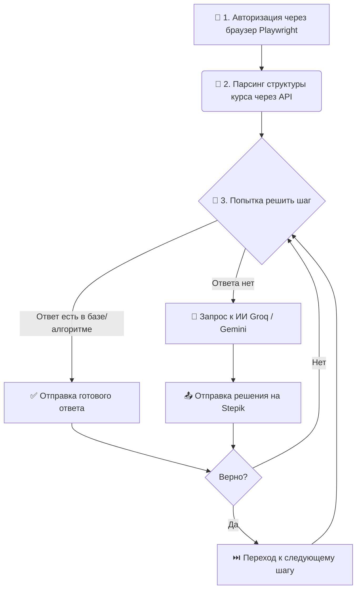

<div align="center">

# 🤖 Stepik Auto-Solver Bot

[](https://www.python.org/downloads/)
[](https://docs.aiohttp.org/)
[](https://tenacity.readthedocs.io/)
[](https://ai.google.dev/)
[](https://groq.com/)
[](https://www.docker.com/)

**Полностью автоматизированный бот для прохождения курсов на платформе [Stepik](https://stepik.org).**
Вы логинитесь один раз — всё остальное бот делает сам, используя внутреннее API Stepik (`aiohttp`) и мощь современных нейросетей (`google-genai` / `groq`).

</div>

> ⚠️ **ДИСКЛЕЙМЕР:** Проект создан исключительно в исследовательских и образовательных целях. Автоматическое прохождение курсов нарушает пользовательское соглашение Stepik и может привести к блокировке вашего аккаунта. Автор скрипта не несёт ответственности за любые последствия использования данного ПО.

---

## 📋 Оглавление

- [Как это работает](#-как-это-работает)
- [Поддерживаемые типы заданий](#-поддерживаемые-типы-заданий)
- [Выбор ИИ: Gemini vs Groq](#-выбор-ии-gemini-vs-groq)
- [Где взять API ключи?](#-где-взять-api-ключи)
- [Быстрый старт](#-быстрый-старт)
- [Полезные команды](#-полезные-команды)
- [FAQ и решение проблем](#-faq-и-решение-проблем)

---

## 🔄 Как это работает

Ниже представлена логика работы бота:



## ✅ Поддерживаемые типы заданий

Бот умеет распознавать и решать самые популярные форматы заданий:

| Тип задания | Описание | Статус |
|---|---|---|
| Choice | Выбор одного или нескольких вариантов ответа | 🟢 Поддерживается |
| Text | Ввод точного текстового/числового ответа | 🟢 Поддерживается |
| Sorting | Расположение элементов в правильном порядке | 🟢 Поддерживается |
| Matching | Сопоставление элементов (левый столбец → правый) | 🟢 Поддерживается |

## ⚖️ Выбор ИИ: Gemini vs Groq

Бот поддерживает две нейросети. Вы можете использовать любую из них (или обе сразу — бот автоматически переключится, если одна упадет).

**Рекомендации по выбору:**

- 🥇 **Google Gemini (Рекомендуется)** — решает задачи точнее, хорошо понимает сложные вопросы на русском языке. У бесплатного тарифа есть лимиты (15 запросов в минуту / 1500 в день).
- 🥈 **Groq (Llama 3)** — работает очень быстро и имеет большие лимиты, но в некоторых заданиях может ошибаться чаще.

## 🔑 Где взять API ключи?

Для работы бота нужен хотя бы один ключ. Оба сервиса предоставляют ключи бесплатно.

### Google Gemini API Key

1. Перейдите на сайт: [Google AI Studio](https://aistudio.google.com/)
2. Войдите через Google-аккаунт.
3. Нажмите `Create API key`.
4. Скопируйте полученный ключ (начинается с `AIza...`).

### Groq API Key

1. Перейдите на сайт: [GroqCloud Console](https://console.groq.com/)
2. Зарегистрируйтесь / войдите.
3. Нажмите `Create API Key`.
4. Скопируйте полученный ключ (начинается с `gsk_...`).

## 🚀 Быстрый старт

### Требования

Убедитесь, что у вас установлен [Docker Desktop](https://www.docker.com/products/docker-desktop/).

### Шаг 1. Скачайте проект

```bash
git clone https://github.com/ТВОЙ_НИК/stepik-bot.git
cd stepik-bot
```

### Шаг 2. Настройка конфигурации

Создайте файл `.env` и скопируйте в него **все** переменные из `.env_example`:

- Windows (PowerShell): `copy .env_example .env`
- Mac/Linux: `cp .env_example .env`

После этого откройте файл `.env` и заполните значения (например, API-ключи и URL курса):

```ini
# Вставьте хотя бы один ключ:
GEMINI_API_KEY=AIza_ваш_ключ_сюда
GROQ_API_KEY=gsk_ваш_ключ_сюда

# URL курса, который нужно пройти
STEPIK_COURSE_URL=https://stepik.org/course/12345/syllabus
```

### Шаг 3. Запуск бота

```bash
docker-compose up --build -d
```

⏳ Примечание: первый запуск займет 2-5 минут (Docker скачивает Chromium).

### Шаг 4. Авторизация на Stepik (единожды)

Бот работает в фоне. Для авторизации используйте встроенный noVNC:

1. Откройте в браузере: `http://localhost:6080/vnc.html`
2. Нажмите `Connect`.
3. Войдите в аккаунт Stepik.

После входа бот сохранит сессию и начнет решать курс.

### Шаг 5. Наблюдение за прогрессом

```bash
docker-compose logs -f
```

## 💻 Полезные команды

| Команда | Описание |
|---|---|
| `docker-compose up --build -d` | Запустить бота (с пересборкой при изменении кода) |
| `docker-compose logs -f` | Смотреть логи в реальном времени |
| `docker-compose stop` | Поставить бота на паузу |
| `docker-compose start` | Возобновить работу |
| `docker-compose down` | Остановить и удалить контейнер |
| `docker-compose down -v` | ⚠️ Удалить контейнер и сохраненную сессию |

## ❓ FAQ и решение проблем

<details>
<summary><b>1. Docker не запускается (docker: command not found)</b></summary>
Убедитесь, что Docker Desktop запущен.
</details>

<details>
<summary><b>2. Страница http://localhost:6080 не открывается (ERR_CONNECTION_REFUSED)</b></summary>
Подождите 1-2 минуты после запуска. Проверьте статус через <code>docker-compose ps</code>.
</details>

<details>
<summary><b>3. Вижу пустой серый экран в VNC</b></summary>
Подождите 30 секунд. Если не помогло, перезапустите контейнер:
<br><code>docker-compose down && docker-compose up -d</code>
</details>

<details>
<summary><b>4. Ошибки с API ключами (Authentication failed)</b></summary>
Проверьте файл <code>.env</code>. Ключи должны быть без кавычек и пробелов.
</details>

<details>
<summary><b>5. Как пройти другой курс?</b></summary>
Измените <code>STEPIK_COURSE_URL</code> в <code>.env</code> и выполните <code>docker-compose restart</code>.
</details>

<div align="center">
<i>Если вам понравился этот проект, поставьте ⭐ звездочку репозиторию!</i>
</div>
